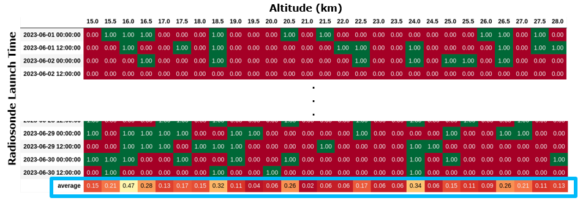
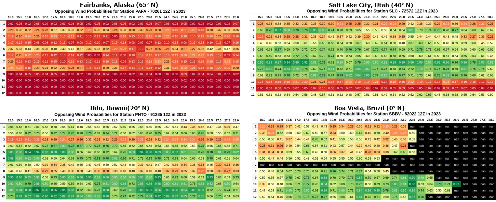

[](https://www.python.org/downloads/release/python-390/)

# RadioWinds
This codebase includes multiple python scripts for analyzing historical winds from public archived sounding data and reanalysis forecasts.  This includes batch downloading the soundings to a local machine for faster and repeatable analysis as well as the analysis itself

## Dependencies

It is highly reccomended to use WSL2 if using Windows.  Several of these python libraries are untested on Windows, but have been tested to run with WSL Ubuntu 22.04 running on Windows 11. 
If still wanting to run directly on windows, see troubleshooting tips below.

For easy install on WSL and Ubuntu use:
```
pip install -r requirements.txt
```

For easy install on Windows use:
```
python3 -m pip install -r requirements-Windows.txt
```

Tested to work on Windows 11 with the following:
* Python Version 3.12
* Conda Version 23.7.4

**TROUBLESHOOTING on Windows**
* It's best to use a virtual [conda enviroment](https://www.anaconda.com/download).
  * `conda create -n RadioWinds`
  * `conda activate RadioWinds`
  * `pip install -r requirements.txt`  (You will get errors here because of cartopy and scipy-iris)
  * `conda install -c conda-forge iris`
  * `conda install -c conda-forge iris-sample-data`
  * `conda install -c conda-forge cartopy`

<!---
OLD Windows debug stuff
'''
**TROUBLESHOOTING cfunits on Windows** Installing cartopy-iris on for mapping and issues with cf-units when installing:
* Install [CMake](https://cmake.org/download/) if not already installed
* Install [Chocolatey](https://chocolatey.org/install)
* Install [UDUNITS 2.2.28](https://docs.unidata.ucar.edu/udunits/current/index.html#Windows:~:text=the%20source%20directory.-,3.3.2%20Installing%20from%20source%20on%20Windows,-Download%20the%20source)
  manually im Powershell using Chocolatey for make
    * With Chocolatey, instead of `make install all` use `choco install make`
    * If trouble with Expat when using cmake, see this [help thread](https://github.com/Unidata/UDUNITS-2/issues/16) 
-->    

**!IMPORTANT: In Siphon, for downloading individual soundings, download the latest version of 
Wyoming.py from siphon Github,  newer than the 0.9 release.** This takes care of the occasional 
height folding issue. We take care of it in ``SiphonMulti.py`` starting on line 131.


## Downloading Historical Sounding Data

There are 3 main sources for aaqquiring sounding data
* https://weather.uwyo.edu/upperair/sounding.html
* https://ruc.noaa.gov/raobs/
* https://www.ncei.noaa.gov/access/metadata/landing-page/bin/iso?id=gov.noaa.ncdc:C00975


We determined that RAOBs is missing wind data outside of the mandatory pressure levels both for ASCII and netcdf format. 

It's also important to note IGRA2 and UofWy have some data discrepencies for the same soundings.  Below is an explanation:


> "
    There are three types of reports at levels below 100 hPa and for levels above 100 hPa.  They are mandatory levels, significant temperature levels, and significant wind levels.  The mandatory levels report pressure, temperature, humidity, and winds at defined pressure levels (1000, 925, 850, 700, ... hPa).  Significant temperature levels report pressure, temperature, and humidity to fill in levels where an observation would be too different from an interpolation.  Significant wind levels report heights and winds.  These are merged into one report.  My software, GEMPAK, interpolates the heights and winds at significant temperature levels and interpolates the height and winds at significant wind levels.  IGRA reports these as missing.
    <br>
    <br>
    In the last few years, these is a new data format called BUFR.  It looks as if IGRA is using some of the data from this format.  I provide this data at:
    <br>
    <br>
    https://weather.uwyo.edu/upperair/bufrraob.shtml
    <br>
    <br>
    I believe the US issues two different types of BUFR reports.  IGRA and I may not be using the same reports.
    <br>
    <br>
    As far as accuracy, my feeling is the inaccuracy of the measurement and variation of the atmosphere are much greater than the method used to present the data.  The BUFR reports may use less smoothing that what is used to generate the old text style reports.
    "<br>
>   <br>
>   FMH3 to be the defining document for radiosondes https://www.icams-portal.gov/resources/ofcm/fmh/FMH3/00-entire-FMH3.pdf
>   <br>
    <br>
    --Larry Oolman (Maintainer of Univerity of Wyoming Upper Air Sounding Dataset)


For this project we use UofWY because the dataset is easier to work with.  You can download an individual sounding or up to a month by modifying the URL,  whereas with IGRA2 you have to download a huge file of every sounding that station ever had and then parse through all the raw text to find the sounding you're looking for. 

## Primary File Summaries

To run properly, and have the scripts be able to find other directories, always run from the main RadioWinds directory. For example:
``python3 analysis/batchAnalysis.py`` Running rom within the other directory might cause issues finding data sources and exporting plots and maps. 


``config.py`` The main configuration file for many of the scripts below.

``utils.py`` Common repeated functions that are used across multiple scripts

``SiphonMulti.py`` This script extends the Siphon Library to be able to download a month of data from UofWy rather than only one sounding at a time.  This greatly speeds up the ability to bulk download soundings 

``AnnualWyomingDownload.py`` This script batch downloads soundings for an entire year locally and organizes the soundings by *year/month/sounding.csv*.  To automate this process we use *continent.csv* in *Radiosonde_String_Parsing/Cleaned/** for a lists of soundings to download from, and then do that for every year.  We use multiprocessing to asyncronously download [multiple stations by month] simultaneously rather than [one station one month] at a time.  

``opposing_wind_wyoming.py`` This script analyzes the wind diversity for an individual sounding.  It checks for 4 categories:  Fail, Calm Winds, Opposings Winds, and Full Wind Diversity. if running this file standalone, it all produces windrose plots of the sounding.

``batchAnalysis.py``  this script does opposing wind anaylsis for a year of soundings per station.  Currently, we assume that the soundings were downloaded properly and in full by ``AnnualWyomingDownload.py.``  (If the script finished running everything should be downloaded for the parameters). We should add some error handling for incomplete downloads. The script then generates binary opposing wind charts organized by date and altitude level (500m increments) for each month.  After all 12 months are analyzed and saved,  a final annual probability chart is saved by taking the max probability from each altitude level per month.

``ERA5.py`` This script creates a *radiosonde-like* dataframe for running ``opposing_wind_wyoming.py`` with ERA5 forecasts.  Download a netcdf ERA5 forecast from https://cds.climate.copernicus.eu/cdsapp#!/dataset/reanalysis-era5-pressure-levels?tab=form which includes the right timestamp, geographic region, pressure levels [300-10hPa], geopotential, u-wind, v-wind, and temperature. 


## Getting Started

### 1. Download Radiosonde Data Locally
To begin using RadioWinds first you need to have monthly radiosonde data locally downloaded by running ``AnnualWyomingDownload.py``. 

The main function gives an example of providing a list of station to download, from a region of interest ("continent").
The script should run as is with the current ``config.py`` variables.

The continent, start_year, end_year, and directories can be modified in ``config.py``
Radiosonde_station_Info/CLEANED gives nice continents to chose as a starting list to download.

These continent csvs were generated by scraping the html from UofWy's Upper Sounding page and generating a csv of the station's info for that region
logging shows additional information text when downloading
parralelizing downloads each station's data for a year in it's on thread, greatly speeding up the download process.
Note: If downloading hangs, follow the instructions at the top ``AnnualWyomingDownload.py``

Several saved data folders will appear as nan - 00000.  This is because several stations don't have an FAA identifier. However the 5 digit code is an active WMO identifier. 

After downloading, run ``checkRadiosondeDownloads.py`` to make sure everything downloaded properly.  If everything downloaded properly, no red text should be output. 
If there is error text, follow the instructions at the top of ``AnnualWyomingDownload.py``.


### 2. Batch Analyze the Radiosonde Data for Wind Diversity
``opposing_wind_wyoming.py`` gives an example of determining wind diversity for an individual sounding and generates some nice plots. 
I recommend running this first to get an idea of what batch analysis is going to do.
The configurable config parameters that this script relies on are:

* **type** : To analyze wind diversity via ALT or PRES (default is ALT for radiosonde, and PRES for ERA5)
* **alt_step** : The altitude step size for wind binning via ALT
* **min_alt**  : the minimum altitude for wind binning via ALT
* **max_alt** : the maximum altitude for wind binning
* **n_sectors** : How many sectors to check for opposing or full winds is (Default is 16
  for opposing winds and 8 for full winds, see figure below)
* **speed_threshold** : The minimum speed of winds to analyze,  anything below this level is considered calm winds
* **min_pressure** : the minimum pressure for wind binning via PRES
* **max_pressure** : the maximum pressure for wind binning via PRES


``batchAnalysis.py`` provides methods for batch analyzing multiple stations for wind diversity one **month** at a time, 
and exporting the analyzed results for faster plotting by other scripts. The main function provides an example of how to analyze all the monthly and annual data
for an individual station in a given year using a list of stations for a continent. It should run as is if the sounding data for the given **start_year** and **end_year** range is downloaded.

Once the script is finished, run the script again.  If all output text is green, then the monthly and annual data should be fully analyzed. 

Recommended config settings:

* **mode** = "radiosonde" (era5 will under predict opposing winds due to low vertical resolution)
* **type** = "ALT"  (pressure is binned into mandatory pressure levels, for ERA5 support, so the vertical resolution is limited and very spread out)
* **logging** = False
* **parallelize** = True
* **monthly_export_color** = False
* **annual_export_color** = False


Setting **monthly_export_color** or **annual_export_color** to *True* will generate colored
dataframe tables like below.  Generating colored tables, significantly increases processing time.




### 2a. Batch Analyze ERA Data for Wind Diversity

Another parameter in ``config.py`` is the **mode**, which can be *"radiosonde"* or *"era5"*. The default is to use radiosonde data for wind diversity, because of the significantly higher vertical resolution.
But we also provide a method for performing the same analysis with ERA5 Reanalysis forecasts.

ERA5 forecasts are convienently split into pressure levels.
If downloading a different range of pressure levels, you will need to update **era5_pressure_levels** in ``config.py``.

The default **era5_pressure_levels** for wind diversity
analysis for HAPS is between 10-300 hpa (~10-30 km). 

``era5_pressure_levels = np.asarray([300, 250, 225, 200, 175, 150, 125, 100, 70, 50,  30,  20, 10])``

Download ERA5 Reanalyis forecasts from [Copernicus](https://cds.climate.copernicus.eu/cdsapp#!/dataset/reanalysis-era5-pressure-levels?tab=form).
Below shows example parameters for downloading forecasts for wind diversity analysis in North America in 2024:


Note: ERA5 forecasts may need to be downloaded in batches depending on the region or time periods of interest. 
The copernicus server does not support downloads over 10 gigs.

Option 1 is to do 2 different regions at a time. For instance North America, and then South America. This is what I've been doing

Option 2 is to partially download the region of interest then combine files.


Download a netcdf ERA5 forecast from https://cds.climate.copernicus.eu/cdsapp#!/dataset/reanalysis-era5-pressure-levels?tab=form
which includes the right timestamp, geographic region, pressure levels [300-10hPa], 
geopotential, u-wind, v-wind, and temperature.


### 3a. Plotting and Mapping for 1 Station

* ``plot3DWindrose.py``:

* ``plot_wind_quadrants.py``
* ``skew-T.py`` [TODO]
* ``diurnal.py`` [TODO]


### 3b. Plotting and Mapping for 1 Station
The following scripts generate plots and maps of monthyl and annual wind diverstiy trends. These plots assume all the radiosonde
data for the desired **year** and **continent** have been downloaded (``AnnualWyomingDownload.py``).  As well as the
corresponding analysis scripts (``batchAnalysis.py``,``batchAnalysis-Calm.py``, ``batchAnalysis-Burst.py``)


Annual Plotting and Mapping Scripts:
* ``Mapping/map_stations.py``:

* ``Mapping/burst_map.py``:

* ``plotting/hovmoller-full-wind-station.py``:

* ``Mapping/rainbow_probabilities.py``:

* ``Mapping/difference_maps.py``:

* ``Mapping/era5scatterplot.py``:


### 4. Decadal Analysis, Plotting, and Mapping

First, make sure the analysis files in step 3 have been run for the **years** and **regions** of interest 
before trying to run decadal analysis scripts.  Some plots and maps require running an additional decadal analysis script.

Decadal Analysis scripts:
* ``decadal_ow_analysis.py``
* ``analyzeMonthlyMeans-Zonal-QBO.py``

Decadal Plotting and Mapping Scripts:
* ``decadal_variance_map.py``

* ``colormesh-CW.py``

* ``hovmoller-ow-probability-station.py``

* ``hovmoller_qbo.py``


## Notes/Discussion
* While not the same, we assume geopotential height and geometric height are the same for this analysis.  At stratospheric altitudes, the difference is usually 100-200m of difference. 
* When binning winds,  it can be good to go over the limit to include some measurements outside the desired range for more accurate results. 
  * For instance, when doing radiosonde-based batch analysis with a pressure of 125 hPa, anything above 125 won't be included even though 126hPa is much closer to the mandatory pressure level of 125 than the next highest level of 150.  This causes lower opposing wind probabilities at the maximum and minimum altitudes. 
* Pressure is not linear like altitude,  so binning to the mandatory levels may not be the best method for radiosonde data.  Because higher altitudes will have a lot more readings assigned to the pressure levels since they are more spaced out. 
* Altitude is tough to compare between radiosonde and ERA5 forecasts because of the geopotential to height conversion.  (The heights are not the same level for every location and time of year).  Therefore pressure makes more sense to compare,  however the pressure bins are huge altitude gaps, so that doesn't tell the full story either. 
* Wind transition regions between 2 opposing wind altitudes levels have the most variability and calm winds.  Many commercial balloon navigators try to avoid these regions because they're unpredictable 
* The UofWy maps where we downloaded the continent stations lists from, changes from day to day, based on launches for that day.  So there's a good chance our station lists are missing a few.

## Authors

* **Tristan Schuler** - *U.S. Naval Research Laboratory*
* **Craig Motell** - *NIWC Pacific*

## Acknowledgments

Hat Tip to [Raven Aerostar](https://www.dropbox.com/s/l5t9zw653nywuqh/Mike%20Smith%20-%20Mike_Smith_Presentation_2021.pdf?dl=0), who did similar analysis in the past and presented at the [2021 Scientific Ballooning Technologies Workshop](https://sites.google.com/umn.edu/2021-scientific-ballooning-tec)
